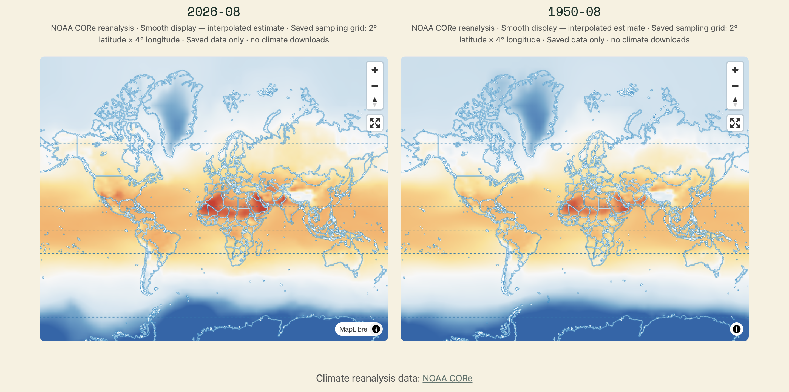

# Climate

> [!IMPORTANT]
> This repository is an AI-assisted refactor produced with [OpenAI Codex](https://openai.com/codex/) (GPT-5). It is derived from [iktCalT/climate](https://github.com/iktCalT/climate), which its human author implemented as a CS50 final project with substantial guidance from [ChatGPT](https://chatgpt.com/). Keep this work in the `climate2` fork; do not push these commits to the original repository.

Climate is a Flask website for exploring historical climate data and encouraging awareness of environmental protection. Its maps and location histories invite exploration of broad patterns, not high-precision reports. Maps read saved values from PostgreSQL; selected NOAA Locations can progressively fetch missing completed months in the background. The active public dataset is NOAA CORe reanalysis; Open-Meteo CMIP6 rows remain stored separately for comparison.

## Demo



*Side-by-side exploration of saved NOAA CORe data: August 2026 and August 1950.
Both panels use the same manually selected color scale. Smooth colors are
interpolated estimates from the saved 2° × 4° grid, not extra source detail.
This static example is not a live coverage report or evidence of a long-term trend.*

Screenshot supplied by the project owner (October 2026), showing the climate2
interface. Data: [NOAA CORe](https://psl.noaa.gov/data/coreinfo.html).
Map rendering: [MapLibre GL JS](https://maplibre.org/maplibre-gl-js/docs/)
with the [MapLibre demo basemap](https://github.com/maplibre/demotiles).
The original visible source credits are retained; see [external-source attribution](#external-sources-and-attribution)
for source and licence details.

## Current features

Hosted registration is temporarily closed because the owner has no time to
manage accounts. The registration page has no signup form and the server rejects
registration submissions. Existing administrator login remains available.
For a fresh deployment, initialize private account storage and run the
terminal-only `python -m climate.cli.manage_users create-admin ADMIN_USERNAME`;
see [administrator setup](docs/USER_ROLES.md#first-administrator-on-a-new-deployment).
Password entry is hidden and interactive; hosted registration stays closed.
An optional device-local profile stores a nickname and ownership credential only
after explicit storage consent; no email or password is required. When enabled
by the operator, visitors can publish a pin with one public comment, read comments
by clicking pins, and delete their own pins. Administrators can remove any pin.
With placement on, clicking a map or entering valid coordinates shows a labelled
unpublished draft pin on every ready comparison map. The preview needs no local
profile or storage consent and sends nothing; turning placement off clears it.
Only a separate submission with a local profile and explicit public consent
publishes a pin.
The default allowance is 10 active pins per browser identity (configurable, e.g.
3 later), with network rate limits. Clearing storage can bypass identity quotas
and loses deletion credentials; it does not remove public posts. Forget this
device asks for confirmation before clearing the local profile, warning that
public pins remain and this device will lose the credential needed to delete
them. Clustering is deferred. This is not a secure hosted account or a
maintenance-free moderation system. Community APIs fail closed until explicitly
enabled with private configuration; see [community setup and privacy](docs/COMMUNITY.md).

NOAA Location history samples the imported 2° ×
4° NOAA grid by rounding to the closest latitude and circular longitude, with
ties toward the smaller coordinate. Dateline aliases use −180°; sampled poles
use 0° longitude. Requested/sample coordinates and approximate distance are
shown, and missing months never trigger a farther search or another provider.
When enabled, only that sampled point's missing completed NOAA months are
retrieved; no whole-grid rows are saved by this path.
CMIP6 keeps exact-coordinate lookup. Both retain the January 1951 history start.

Provider isolation: Open-Meteo ingestion, prefetch checkpoints and legacy CMIP6
migration use an explicit source identity independent of the public-read selector.
The comparison command always compares NOAA against CMIP6. Changing the public
selector never relabels or rewrites either source.

Home, Maps and Locations use compact controls and short summaries, with
expandable help for comparison, sampling and seasonal details. Source/coverage
warnings and the manual shared map scale remain visible. References retains its
full documentation and layout.
References separates current data limitations from historical import checkpoints
and retains the source/software credits. Selectable months do not guarantee local
coverage: temperatures are °C, and precipitation is mean daily mm/day, not a
monthly total.

- **Maps:** a flat, fullscreen-capable MapLibre map for mean, maximum, or minimum temperature and precipitation from January 1950 through the current month. Labels read “Mean temperature (°C),” “Maximum temperature (°C),” “Minimum temperature (°C),” and “Mean daily precipitation (mm/day)”; each precipitation value is a monthly average daily rate, not a monthly total. Opening Maps shows the newest saved active-provider mean-temperature month, no later than the stable-date limit (previous month during the first six UTC hours of a new month, current month otherwise), and starts with a flat world overview (within the supported ±85° latitude bounds). Explicitly selected dates are never replaced. If no suitable saved month exists, the date selector opens instead. Users can compare two through four distinct months side by side; moving any panel synchronizes every viewport, and all panels share one visible, manually selected preset or custom scale and legend. The scale stays fixed through panning, zooming, loading, date changes, and page reloads until changed manually. NOAA's active public map uses a smooth raster of bilinearly interpolated numeric values from the saved 2° × 4° sampling grid; these are labelled interpolated estimates, add no source resolution or accuracy, and leave missing samples transparent. CMIP6 keeps its existing tile display: its global overview fits within a 91-by-91 grid using 2-degree latitude by 4-degree longitude cells, with zoom subdivision stopping at 0.5-degree latitude by 1-degree longitude cells. Maps stop at city-scale zoom level 10. Public viewport requests never fetch missing climate cells; nothing is queued for download.
- **Maps retry:** a failed viewport request offers **Retry saved data** for that month and panel. It repeats the saved-cache read only after an explicit click; empty coverage and out-of-world views do not offer retry.
- **Map coordinates:** on an open Maps page, enter decimal latitude (−85 to 85) and longitude (−180 to 180) to center every ready panel and open the linked readouts. Negative latitude means south and negative longitude means west. Invalid coordinates leave the maps unchanged; missing saved values remain missing. Clear location closes readouts without moving the maps or requesting data.
- **Locations:** displays four seasonal history lines at a time for one latitude/longitude from January 1951 through the last completed month. Mean temperature is selected by default, with minimum temperature, maximum temperature, and precipitation available from the chart menu. The coordinate form accepts decimals without a 0.01° step restriction; negative latitude means south and negative longitude means west. Valid map selections link here using their selected coordinates, though history's own provider sampling rule may differ from a map display estimate. Saved NOAA values appear immediately; missing months for that sample download one at a time under global limits, and the chart refreshes after each success. Failed, interrupted and throttled work stops for an explicit retry. Fixed Northern Hemisphere calendar groups are March–May, June–August, September–November, and December–February; winter is labelled by January's year, and these season names may not match local seasons everywhere. Each point shows its contributing stored months out of three; this describes coverage, not measurement accuracy. Precipitation is a monthly average daily rate in mm/day. Rendered chart URLs are keyed to current data content and chart version so imports, cleanup, and chart updates are reflected on the next page request.
- **Edit Location coordinates:** the coordinate form stays visible above saved history and empty results, prefilled with your requested coordinates rather than NOAA's sampled grid point. Submit **Update location** to view another location using the same saved-cache lookup; editing fields alone leaves the displayed history unchanged. **Clear** returns to blank entry fields without reading history. Saved results work without JavaScript; automatic NOAA gap fetching needs it.
- **Accounts:** visitors and normal registered users can browse climate data. Administrators can start/resume bounded NOAA edge-window batches and view live coverage through `/admin/data`. The older Open-Meteo point-grid tool remains at `/update` for advanced use.
- **Local-first storage:** weather data uses PostgreSQL 18. Every climate row is scoped to an explicit provider/product identifier, and all current public reads select `noaa_core`. Open-Meteo acquisition and migration remain pinned to `open_meteo_cmip6`; switching public reads does not relabel or rewrite stored rows. Account and profile data remains in a separate, ignored SQLite file so new personal information is not committed.
- **Resumable NOAA bulk import:** `import_noaa_core.py` anonymously retrieves only the indexed NOAA CORe GRIB2 records needed for a complete month, derives monthly extremes from daily records, nearest-samples the native Gaussian grid to the canonical 2°×4° points, validates metadata and physical bounds, and commits the month atomically under `noaa_core`. If a daily file omits both extrema, the importer may recover them only from all eight exact 0–3 hour extrema pairs in NOAA's official 3-hourly archive; any incomplete fallback rejects the month. PostgreSQL is the checkpoint, the default batch is one month, and full 1950–present selection is explicit rather than automatic.
- **Read-only provider review:** `compare_climate_providers.py` compares up to 12 imported months across NOAA and Open-Meteo rows already in PostgreSQL. It reports canonical-grid coverage, per-metric deltas, and stable land, ocean, polar, and dateline samples as Markdown without contacting either provider, writing the database, or changing the website selector.

On **Maps → Change selection**, the variable selector uses readable names and
units while its submitted values remain the application's metric keys.
**Mean daily precipitation (mm/day)** is averaged over each month as a daily
rate, not totaled across the month. **Find a saved month** lists saved dates and
finite-value point counts for the chosen variable. Use a date as the first
month or add it to a comparison; manual date entry remains available. Counts
are global, not a claim of complete US/viewport coverage or verified accuracy.
Changing the variable refreshes the saved-date list but never changes dates
already entered. Opening **Change selection** from a map carries its ordered
months and variable into the editable form; submitting keeps the first month as
the comparison baseline. Availability uses one read-only, active-provider PostgreSQL
aggregation with a three-second statement timeout and a short lock timeout;
if it fails, the selector explains the problem and keeps manual entry usable.
The listing refreshes on a new page request, so imports and cleanup affect the
next visit without a persistent availability cache. No packages were added.

The displayed values are gridded climate estimates, not direct station
observations. On open Maps pages, valid typed coordinates recenter all panels
and open linked readouts; clearing the selection does not pan or fetch data.
NOAA's smooth map interpolates the saved 2° × 4° grid without
adding source detail or accuracy. A comparison of two months does not establish
a long-term climate trend. See the in-app References page for data and software
attribution.

The shared footer follows the active climate provider and currently credits NOAA CORe.

The active public provider is selected by `ACTIVE_CLIMATE_PROVIDER` at startup.
Changing it requires an application restart and only changes which saved rows
public pages read; it does not rewrite stored data. Rollback sets the selector
to `open_meteo_cmip6` and restarts the application.

## Provider status

- **Current data scope:** administrator-started global NOAA fetching is limited to 1950–1954 and 2022–2026, through the latest complete month. Selected-location fetching is a separate, bounded exception that can fill one sample's missing history from 1951 through the last complete month. Manual global full-history and 2016–2026 backfill work is no longer a priority; saved rows remain intact unless an administrator explicitly uses the optional cleanup tool. NOAA CORe is the active public provider; Open-Meteo CMIP6 remains stored separately. Some inherited Open-Meteo ocean temperatures disagree with fresh source checks and have not been repaired. See the [provider evaluation](docs/CLIMATE_PROVIDER_EVALUATION.md).

On 2026-09-26, the administrator coverage check found both windows complete:
60/60 months for 1950–1954 and 56/56 for 2022–August 2026. No additional
downloads were needed for this interface change. The admin page reads current
coverage directly from PostgreSQL rather than relying on this dated snapshot.

## Architecture

```text
Browser -> Flask -> provider-scoped PostgreSQL weather cache

Administrator tools -> Open-Meteo or NOAA importer -> PostgreSQL

NOAA CORe -> indexed GRIB2 importer -> PostgreSQL (`noaa_core`)

Accounts -> ignored local SQLite database
```

Code is grouped by responsibility:

- `app.py` / `run.sh` — small Flask entry points.
- `climate/web/` — routes, authentication, validation, and chart presentation.
- `climate/services/` — map tiles and administrator import/cleanup workflows.
- `climate/providers/` — Open-Meteo and NOAA acquisition and validation.
- `climate/data/` — PostgreSQL access, saved-month queries, and calendar helpers.
- `climate/cli/` — explicit administrative commands, run with `python -m`.
- `sql/` — weather, account, and import-job schemas.
- `templates/`, `static/`, `tests/` — page templates, browser assets, and tests.
- `docs/` — project decisions and operating guides; `docs/agents/` holds shared
  instructions, owned logs, and context lookup.

Start with the [architecture guide](docs/ARCHITECTURE.md) or
[documentation index](docs/README.md). Agents should enter through
[AGENTS.md](AGENTS.md) and their [assigned task](docs/AGENT_TASKS.md).

## Local setup on macOS

This project targets PostgreSQL **18** and works on Apple Silicon without machine-specific application code. Run commands from the repository root; `./run.sh` also works when invoked from another directory.

1. Install and start PostgreSQL 18:

   ```sh
   brew install postgresql@18
   brew services start postgresql@18
   /opt/homebrew/opt/postgresql@18/bin/createdb climate
   ```

2. Create a Python environment and install the dependencies:

   ```sh
   python3 -m venv .venv
   .venv/bin/pip install -r requirements.txt
   ```

3. Create the weather and account schemas:

   ```sh
   .venv/bin/python -m climate.cli.setup_database
   .venv/bin/python -m climate.cli.setup_user_database
   ```

4. Start the website:

   ```sh
   .venv/bin/flask --app app run
   ```

The default weather connection is `postgresql://localhost/climate`. To use another local database, set `DATABASE_URL` in the shell that launches Flask. New account databases default to ignored `instance/users.db`, outside public assets. Flask and account tools honor `USER_DATABASE_PATH`; without it, an existing `static/users.db` is retained with a warning so upgrades do not silently replace accounts. See [private account storage](docs/USER_ROLES.md#private-account-storage) before relocating existing data. Never commit credentials or a populated user database; `.env`, database files, profile uploads, generated charts, keys, and local caches are ignored.

For a public server, follow the [production deployment runbook](docs/DEPLOYMENT.md).
It keeps `./run.sh` for local development and uses explicit production settings,
Gunicorn, a private persistent state mount, exact allowed hosts and peer-gated
proxy headers. An optional container image is included but has not been built or
deployed here. On all pages, wheel movement over number fields no longer changes
their value; typing, keyboard arrows, spinner buttons and map zoom remain usable.

Flask blocks recognizable database/backup filenames and sidecars, hidden files, the configured
account database, and static paths escaping the public root. A separate web server
serving static files must apply its own restrictions; keep private data outside
its public directory, including arbitrarily renamed backups that filename checks
cannot identify. No account database is automatically moved or deleted.

If you still have the legacy weather database, its non-personal climate rows can be imported once:

```sh
.venv/bin/python -m climate.cli.migrate_weather_sqlite static/weather.db
```

The migration is optional and safe to rerun. Maps remain saved-data-only; NOAA Locations can fill missing completed months for the selected sample when enabled. Public reads select only `noaa_core`; Open-Meteo rows remain separate. PostgreSQL climate rows do not expire automatically; administrators can deliberately update or clean them. Identical Open-Meteo responses used by acquisition tools are cached locally for seven days. NOAA's archive serves global GRIB fields, so even a single-sample month may require many daily records and take several minutes; full history is not immediate. See [Location fetching setup and limits](docs/POSTGRESQL.md#location-history-gap-fetching). Sparse or empty views remain possible.

To resumably fill the canonical global grid for 1950–1953 and 2023–2026,
run a bounded batch repeatedly:

```sh
.venv/bin/python -m climate.cli.prefetch_climate --dry-run
.venv/bin/python -m climate.cli.prefetch_climate
```

PostgreSQL is the checkpoint. Complete locations are skipped, missing
contiguous month ranges are fetched, and every successful range is committed
independently. Each run checks at most 100 incomplete locations; use a smaller
batch with `--limit NUMBER` when needed. Provider requests start at least 30
seconds apart by default because Climate API usage is weighted by time span,
variables, and models. The batch stops on its first provider failure and can be
resumed later. Use `--delay-seconds NUMBER` only when a different pacing policy
is appropriate for the available Open-Meteo plan.

The higher-capacity NOAA path works month-by-month across the whole canonical
grid. It needs no account or secret:

```sh
.venv/bin/python -m eccodes selfcheck
.venv/bin/python -m climate.cli.import_noaa_core --dry-run
.venv/bin/python -m climate.cli.import_noaa_core --period 1950-1953
.venv/bin/python -m climate.cli.import_noaa_core --period 2023-2026
.venv/bin/python -m climate.cli.import_noaa_core --period 1950-present --dry-run
.venv/bin/python -m climate.cli.import_noaa_core --period 1950-present --limit 12
.venv/bin/python -m climate.cli.import_noaa_core --period 2016-2026 --newest-first --dry-run
.venv/bin/python -m climate.cli.import_noaa_core --period 2016-2026 --newest-first --limit 12
```

Only complete calendar months are eligible. One month is imported per run by
default; `--limit NUMBER` may raise the batch to at most 12. Use
`--month YYYY-MM --validate-only` to download and validate a sample without a
database write. Each successful month contains all 8,281 canonical locations
and all four metrics in the separate `noaa_core` family. An interrupted month
is retried in full, while a completed month is skipped. If both extrema are
absent from a daily aggregate index, the importer uses all eight exact 0–3
hour extrema pairs from that day's official 3-hourly files; it rejects partial
daily or 3-hourly evidence rather than interpolating or skipping a day. The
local checkpoint completed all 92 edge-period months on 2026-09-25. The active
public selector reads saved `noaa_core` rows; Open-Meteo acquisition continues
to write only `open_meteo_cmip6`. The `1950-present` period is opt-in and dynamically stops
at the latest complete month; use `--through YYYY-MM` to set an earlier bound.
Default selection remains the two recorded edge periods, so a normal rerun
does not unexpectedly begin the much larger full-history job.

Those CLI periods remain available for compatibility, but routine acquisition
now uses **Admin → Data** at `/admin/data`: select 1950–1954 or 2022–2026,
choose 1–12 months (default 1), and click **Start / resume batch**. The last
window runs newest-first. Both windows stop at complete months and skip saved
months. Status refreshes while a job runs; opening the page never downloads.

Run `python -m climate.cli.setup_database` once after upgrading to install the additive
`sql/admin_import.sql` job-status table. Keep the app server running while a batch
works. The background thread is not a durable queue: a server restart interrupts
unfinished work, but committed months survive and the page offers manual resume.
PostgreSQL serializes administrator batches across web workers. Do not run the
standalone CLI importer concurrently with the admin tool. Admin rights are
checked on every request, starts require a session-bound CSRF token, and public
errors contain no raw connection details. No credentials are entered in the UI.

### Optional administrator cleanup

On **Admin → Data**, choose **Preview cleanup (no deletion)** to see retained
and removable row counts for each provider. Cleanup keeps every climate row in
**1950–1954 and 2022–2026**, and removes only rows outside those windows, from
all providers, including stored Open-Meteo CMIP6 rows. Back up PostgreSQL first if you need
exact recovery: there is no in-app undo and re-fetching can return revised data.
After reviewing the counts, check the explicit confirmation and click
**Delete up to 50,000 rows**. Each click commits one bounded batch. Preview and
confirm again to continue; nothing deletes automatically. Preview tokens expire
after 10 minutes. The reusable functions are `cleanup_preview()` and
`cleanup_batch()` in `climate/services/admin_cleanup.py`; the latter is destructive and must only
be called deliberately. The website enforces current admin rights and CSRF.

Cleanup shares the admin import lock, uses 2-second lock and 30-second statement
timeouts, and rolls back SQL failures. Pause CLI imports before cleanup.
Accounts, profiles, location definitions, downloaded files, and rendered caches
are untouched. This is manual pruning, **not an enforced retention policy**:
public browsing no longer refills removed rows, but explicit import tools can.
New location page requests use a chart URL based on current cached data; an
already-open chart or a directly accessed old generated file can still show old
values. Pruning alone is not a guarantee of faster indexed queries.

The bounded SQL follows PostgreSQL's documented
[batch DELETE pattern](https://www.postgresql.org/docs/18/sql-delete.html).
[Routine vacuuming](https://www.postgresql.org/docs/18/routine-vacuuming.html)
reclaims deleted space for reuse and refreshes planner statistics; deleting rows
does not immediately shrink the database file. This page never runs disruptive
`VACUUM FULL`. PostgreSQL and its documentation use the
[PostgreSQL License](https://www.postgresql.org/about/licence/).

For finer comparison colors, manually choose **Cold detail** (−10 to 10 °C),
**Mild detail** (0 to 20 °C), or **Warm detail** (20 to 40 °C). Their color stops
are 2 °C apart, with continuous interpolation. All panels share that scale;
saved presets/custom scales are preserved. Values outside the selected range
use the endpoint colors. Initialized panels apply manual changes immediately,
even while basemap sources are loading; panels still initializing use the latest
selection on their first render. Scale changes make no climate-data requests.
More contrast is not greater data accuracy.

Click a location on any comparison map to show that same location on every
panel. NOAA readouts use the same numeric bilinear interpolation as the raster
and are labelled estimates; CMIP6 readouts retain their loaded grid-cell value
and provenance. Selected coordinates and source grid centers are distinct.
The first month is the labelled baseline; later panels show their signed value
difference in °C or mm/day when both cells have finite values. Popup labels and
values appear on separate rows for readability. Unavailable
differences explain whether the baseline or current month is loading, failed, or
missing coverage. Estimate-based differences are labelled, and displayed
numbers use at most two decimal places while calculations use the raw values.
These are differences between coarse displayed grid values, not exact-location
observations or a climate trend.
Click another location to replace the selection, or close any popup to clear
all. A single map shows its ordinary value without a baseline or difference.
Valid selected coordinates also link to saved Location history using the selected
coordinate precision, including when map values are loading or missing. History
uses its own provider sampling rule and may differ from a map display estimate.
The link itself does not fetch data or navigate automatically; the interaction
never changes the color scale.

Compare only rows already stored in PostgreSQL after importing review months:

```sh
.venv/bin/python -m climate.cli.compare_climate_providers --month 1950-01
.venv/bin/python -m climate.cli.compare_climate_providers --month 1952-02 --month 2023-07
```

At most 12 distinct complete months may be requested. With no `--month`, the
command selects the latest 12 available CORe months. It opens a read-only
transaction, ignores non-canonical user-entered coordinates, and prints a
Markdown report to standard output. `COMPLETE` means both providers contain
all required comparison values for the selected canonical grid; it does not
establish accuracy or complete coverage beyond those months. CORe and the
two-model CMIP6 average remain different products; their values and provenance
are never blended.

## Administrator setup

Registration always creates a normal user. Promote or demote an existing local account with:

```sh
.venv/bin/python -m climate.cli.manage_users grant-admin USERNAME
.venv/bin/python -m climate.cli.manage_users revoke-admin USERNAME
```

See [docs/USER_ROLES.md](docs/USER_ROLES.md) for administrator ingest limits and [docs/POSTGRESQL.md](docs/POSTGRESQL.md) for database details.

## Testing

Run the offline regression suite from the repository root:

```sh
DATABASE_URL= PYTHONDONTWRITEBYTECODE=1 .venv/bin/python -m unittest discover -s tests
node --test tests/test_map_scales.mjs
```

The route tests use temporary account databases and do not modify personal account data.
The empty `DATABASE_URL` skips live PostgreSQL tests. Only enable database
integration checks against an explicitly isolated test database.
Optional real-SQL cleanup tests create only connection-local temporary tables:
`CLIMATE_CLEANUP_PG_TEST=1 .venv/bin/python -m unittest discover -s tests -p 'test_admin_cleanup.py'`.
They verify date boundaries, all-provider retention, batch limits, rollback, and
import-lock conflicts without deleting application climate rows.

## Repository privacy

Never commit or push `.env` files, database passwords, API tokens, private
keys, populated databases, session data, personal account data, or
machine-specific configuration. Keep sensitive values in ignored local files
or environment variables; documented examples may contain only clearly fake,
non-functional placeholders.

The repository ignores common secret, credential, key, and database filename
patterns as a backstop. Before every commit and push, inspect the staged file
list and scan staged content for likely secrets because `.gitignore` cannot
protect a file that is already tracked or staged. If a real credential is ever
exposed, remove it from the change without repeating its value and rotate or
revoke it before publishing.

## Refactor documentation

- [Deployment options](docs/DEPLOYMENT_OPTIONS.md) — hosting costs, management effort and local/online portability; no provider selected yet.
- [Refactor plan](docs/REFACTOR.md) — the agreed, unchanged source plan.
- [PostgreSQL 18 setup](docs/POSTGRESQL.md)
- [User roles](docs/USER_ROLES.md)
- [Project direction and publication boundaries](docs/PROJECT_DIRECTION.md)
- [Recorded follow-up requirements](docs/NEXT_REQUIREMENTS.md)
- [Climate provider evaluation](docs/CLIMATE_PROVIDER_EVALUATION.md)

## External sources and attribution

Every external package, service, dataset, webpage, image, font, code source, or
other third-party resource used by this project must be credited here and on
the in-app References page in the same change that introduces it. Prefer a
canonical provider link and record the purpose and licence requirements when
available.

Current data and evaluated providers:

- [Open-Meteo Climate API](https://open-meteo.com/en/docs/climate-api) supplied the separately stored downscaled climate-model data; its underlying models follow the [CMIP6 terms](https://pcmdi.llnl.gov/CMIP6/TermsOfUse).
- [NOAA Conventional Observation Reanalysis (CORe)](https://www.cpc.ncep.noaa.gov/products/CORe/index.html), its [public NODD archive](https://www.cpc.ncep.noaa.gov/products/CORe/archive.html), and [field/retrieval documentation](https://ftp.cpc.ncep.noaa.gov/CORe/get_core/get_core.txt) define the active public data source, anonymous bulk importer, and bounded Location gap fetching. The retrieval guide documents the monthly, daily, and 3-hourly file layout used by the exact daily-extrema fallback. NOAA documents the analyses and downloader as public domain; the [NOAA NCEI open-data policy](https://www.ncei.noaa.gov/sites/default/files/2023-12/NCEI%20PD-10-2-02%20-%20Open%20Data%20Policy%20Signed.pdf) explains NOAA's public-domain and CC0 policy.
- NOAA's [CORe regridding guidance](https://www.cpc.ncep.noaa.gov/products/CORe/regridding.html) documents its 512-by-256 Gaussian grid, the [Physical Sciences Laboratory overview](https://psl.noaa.gov/data/coreinfo.html) describes its reanalysis role, and the [Weather Program Office announcement](https://wpo.noaa.gov/ncep-introduces-operational-reanalysis-for-climate-monitoring-core/) records the operational transition. The [NCEP/NCAR Reanalysis 1 update notice](https://psl.noaa.gov/news/2026/r1datanotice.html) explains why that retired predecessor was not selected.
- [Copernicus CDS ERA5 monthly data](https://cds.climate.copernicus.eu/datasets/reanalysis-era5-single-levels-monthly-means?tab=overview) remains an evaluated alternative under CC BY, but was not selected because programmatic retrieval requires an account, dataset-licence acceptance, and a private token.
- [NASA POWER](https://power.larc.nasa.gov/docs/services/api/temporal/monthly/) and [CRU gridded datasets](https://crudata.uea.ac.uk/cru/data/hrg/) were evaluated as documented alternatives but are not active providers.

Deployment research (evaluated, not deployed; checked 2026-10-03):

- Render [pricing](https://render.com/pricing), [persistent disks](https://render.com/docs/disks) and [free-service limits](https://render.com/docs/free) inform the managed-hosting comparison.
- Railway [pricing](https://docs.railway.com/pricing/plans), [database responsibilities](https://docs.railway.com/databases), [volumes](https://docs.railway.com/volumes/reference) and [backups](https://docs.railway.com/volumes/backups) inform the usage-based alternative.
- DigitalOcean [Droplet pricing](https://www.digitalocean.com/pricing/droplets) and [backup pricing](https://docs.digitalocean.com/products/backups/details/pricing/) inform the self-managed VPS alternative.
- [Flask production deployment](https://flask.palletsprojects.com/en/stable/deploying/) and [Docker Compose documentation](https://docs.docker.com/compose/) informed the portability assessment. Compose remains research only. No subscription or terms acceptance has occurred; hosting services retain their own terms.
- [Flask's Gunicorn deployment guidance](https://flask.palletsprojects.com/en/stable/deploying/gunicorn/) and [proxy guidance](https://flask.palletsprojects.com/en/stable/deploying/proxy_fix/) inform WSGI launch and explicit forwarded-header trust. [Gunicorn](https://gunicorn.org/) is the production server dependency ([MIT licence](https://github.com/benoitc/gunicorn/blob/master/LICENSE)).
- [Docker build-context documentation](https://docs.docker.com/build/concepts/context/) informs the default-deny image context; the [official Python container image](https://hub.docker.com/_/python) supplies the optional runtime. [MDN's wheel event reference](https://developer.mozilla.org/en-US/docs/Web/API/Element/wheel_event) informs the numeric-input guard.
- [Moby's pattern matcher source](https://github.com/moby/patternmatcher/blob/main/patternmatcher.go) explains why directory exceptions can include descendants in Docker build contexts; its [Apache 2.0 licence](https://github.com/moby/patternmatcher/blob/main/LICENSE) applies to that reference implementation. The image context now enumerates exact runtime files.
- [Cloudflare Full (strict)](https://developers.cloudflare.com/ssl/origin-configuration/ssl-modes/full-strict/) and [Cloudflare HTTP header guidance](https://developers.cloudflare.com/fundamentals/reference/http-headers/) inform origin TLS and forwarding assumptions. [Google Cloud Run's container contract](https://docs.cloud.google.com/run/docs/container-contract) documents its ephemeral writable filesystem; durable account/community mode is not offered there.

Current application software and delivery services:

- [Python threading](https://docs.python.org/3/library/threading.html) (Python Software Foundation licence) runs bounded background admin batches; no task-queue dependency was added.
- [Python hashlib](https://docs.python.org/3/library/hashlib.html) (Python Software Foundation licence) creates SHA-256 data-content keys for location chart reuse without stale results after imports or cleanup.
- [Python sqlite3](https://docs.python.org/3/library/sqlite3.html) and [contextlib.closing](https://docs.python.org/3/library/contextlib.html#contextlib.closing) (Python Software Foundation licence) provide local account storage and explicit connection closure; the SQLite transaction context alone does not close a connection.
- [Node.js](https://nodejs.org/) runs the dependency-free map-scale tests (`node tests/test_map_scales.mjs`); Node is MIT-licensed with bundled third-party notices in its [licence](https://github.com/nodejs/node/blob/main/LICENSE).

- [ECMWF ecCodes Python](https://github.com/ecmwf/eccodes-python) decodes the selected NOAA GRIB2 records and is distributed under Apache License 2.0. Its PyPI installation includes the binary ecCodes library on macOS and Linux.
- [Flask](https://flask.palletsprojects.com/en/stable/) and [Flask-Session](https://flask-session.readthedocs.io/en/latest/) provide the web application and server-side sessions.
- [PostgreSQL](https://www.postgresql.org/docs/18/) and [Psycopg](https://www.psycopg.org/psycopg3/docs/) provide climate storage, read-only saved-month aggregation, bounded query execution, and Python database access.
- [NumPy](https://numpy.org/doc/stable/), [pandas](https://pandas.pydata.org/docs/), and [Plotly Python](https://plotly.com/python/) provide numerical work, monthly aggregation, and charts. Plotly's [hover text and formatting guide](https://plotly.com/python/hover-text-and-formatting/) and [Scatter customdata reference](https://plotly.com/python/reference/scatter/#scatter-customdata) document the per-point coverage metadata used in chart hovers; Plotly Python is MIT-licensed.
- [Open-Meteo's Python client](https://github.com/open-meteo/python-requests), [requests-cache](https://requests-cache.readthedocs.io/en/stable/), and [retry-requests](https://github.com/MazeMap/retry-requests) provide API transport, local response caching, and bounded retries.
- [MapLibre GL JS](https://maplibre.org/maplibre-gl-js/docs/) (BSD-3-Clause) renders maps using the [MapLibre demo style and tiles](https://github.com/maplibre/demotiles). Its [Popup API](https://maplibre.org/maplibre-gl-js/docs/API/classes/Popup/) supplies linked, text-safe location readouts across comparison panels. The [Canvas Source API](https://maplibre.org/maplibre-gl-js/docs/API/classes/CanvasSource/) displays the static interpolated NOAA raster, and the [layer style specification](https://maplibre.org/maplibre-style-spec/layers/) documents the fill, line, symbol, and raster layer behavior used to keep geography neutral and borders/labels visible.
- [ColorBrewer 2.0](https://colorbrewer2.org/) provides the cartographic diverging and sequential palette guidance adapted for the temperature and precipitation scale presets.
- MapLibre GL JS v6.6.0's [map implementation](https://raw.githubusercontent.com/maplibre/maplibre-gl-js/v6.6.0/src/ui/map.ts) and [style implementation](https://raw.githubusercontent.com/maplibre/maplibre-gl-js/v6.6.0/src/style/style.ts) (BSD-3-Clause) document why full style-loading checks include source completion; manual map-scale changes instead track initialized panels.
- [Bootstrap 5](https://getbootstrap.com/docs/5.3/) is delivered through [jsDelivr](https://www.jsdelivr.com/), and the interface loads Audiowide, Space Mono, and Muli through [Google Fonts](https://fonts.google.com/).

Project, learning, and visual sources:

- The original [iktCalT/climate](https://github.com/iktCalT/climate) project was implemented by its human author as a [CS50x](https://cs50.harvard.edu/x/) final project with substantial [ChatGPT](https://chatgpt.com/) guidance. Authentication and error-page helper patterns were adapted from CS50 course material.
- The climate favicon is sourced from [Iconfinder](https://www.iconfinder.com/icons/9079087/global_warming_climate_change_hot_heat_temperature_icon).
- The local climate error-page illustration was generated specifically for this project with [OpenAI image generation](https://developers.openai.com/api/docs/guides/image-generation). It is not adapted from a third-party character or source image; error messages and status codes remain accessible HTML rather than image text.
- Inactive legacy generated map HTML files under `static/weather_data/` embed [Folium](https://python-visualization.github.io/folium/), [Leaflet](https://leafletjs.com/), [jQuery](https://jquery.com/), [Leaflet.awesome-markers](https://github.com/lennardv2/Leaflet.awesome-markers), [Font Awesome](https://fontawesome.com/), [OpenStreetMap](https://www.openstreetmap.org/copyright), and [CARTO basemaps](https://carto.com/attributions). They are retained only as historical artifacts and are not used by the current MapLibre pages.
- This refactor is produced with [OpenAI Codex](https://openai.com/codex/) under the human owner's direction and review.

## License

See [LICENSE](LICENSE).
