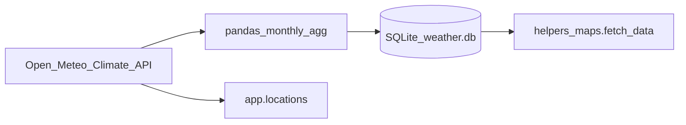

# Climate app refactor

Living spec for refactoring this CS50 Flask project. The original project description stays in [README.md](../README.md). Implement the phases below only after this document is agreed; this file is the source of truth for goals and constraints.

**Machine:** MacBook Air M5 (Apple Silicon). NumPy can use Accelerate; PostgreSQL can run locally via Homebrew (`postgresql@16`) or Postgres.app. No M-series-specific application code is required.

## Goals

1. **Faster, cleaner Python.** Speed up data handling with NumPy where it helps. Untangle `helpers_data.py` / `helpers_maps.py` / `app.py` so fetch, store, and serve are obvious.
2. **SQLite → PostgreSQL.** Replace `static/weather.db` (and, when we get there, the other SQLite files) with a local PostgreSQL database.
3. **Cache, then Open-Meteo.** When someone browses history on the site, serve from the local database if the data exists; if it does not, fetch from [Open-Meteo Climate API](https://open-meteo.com/en/docs/climate-api), store it, then serve.

## Non-goals (for this refactor)

- Keep **Flask** and the existing pages (`/`, `/locations`, `/maps`, login, profile, `/update`, `/references`) unless we decide otherwise later.
- Do **not** rewrite Folium maps or Plotly charts as part of this spec.
- Do **not** move to Docker, cloud Postgres, or drop user accounts unless we explicitly add that work.
- Do **not** rewrite the admin `/update` merge workflow (`weather_update.db` → main weather DB) in the first implementation passes.

## Current architecture

Flask app: location history (`/locations`), climate maps (`/maps`), login and admin ingest (`/update`).

| File | Role |
| --- | --- |
| [app.py](../app.py) | Routes. `/locations` calls Open-Meteo when a chart HTML file is missing, but does **not** look up or persist into `weather.db`. `/maps` only reads the local DB and fills gaps with neighboring cells. |
| [helpers_data.py](../helpers_data.py) | Open-Meteo fetch, pandas monthly aggregation, SQLite insert/update (`weather.db`). |
| [helpers_maps.py](../helpers_maps.py) | Folium maps. `fetch_data` opens a **new SQLite connection and runs a SQL query for every cell** of a 91×91 grid (~8k round-trips). That is the main reason maps are slow, not pandas. |
| [helpers.py](../helpers.py) | Apology, Plotly charts, validators, `login_required`. |

Other SQLite files today:

- `static/users.db` — users and profiles.
- `static/weather_update.db` — admin ingest staging.

Constants in the app: grid `SHAPE = (91, 91)`, climate types `temp_mean` / `temp_max` / `temp_min` / `precip`, date window roughly **1950-01** through **2023-12** for maps (locations can request through “today”).

## Performance plan (NumPy and SQL)

- **Replace per-cell SQL** in `fetch_data` with one (or a few) queries that return all points for a month, then write them into a NumPy array of shape `(nlats, nlons)`.
- Keep **pandas** where it is the right tool: Open-Meteo daily series → monthly resample (`mean` / `max` / `min` as today).
- Avoid nested Python loops over the globe for database I/O.
- Recreate Open-Meteo client / cache session once per batch, not once per location if we can share it.
- On Apple Silicon, use array ops (`np.linspace`, indexing, `np.nan` for missing cells) rather than per-cell Python and neighbor-fill in the inner loop, unless a vectorized fill is still needed for incomplete grids.

## PostgreSQL plan

- One local database, tables at least:
  - `locations` — `loc_id`, `lat`, `lon` (unique on lat/lon).
  - `data` — `loc_id`, `dates`, `temp_mean`, `temp_max`, `temp_min`, `precip`, with a **unique constraint on `(loc_id, dates)`** for upserts (`INSERT ... ON CONFLICT`).
  - Optionally later: `users` / `profiles` in the same database (schema or tables), replacing `users.db`.
- Driver: **psycopg v3** or SQLAlchemy. Prefer a small connection helper so Flask routes and ingest scripts do not scatter `connect()` calls.
- Stop using SQLite `INSERT OR IGNORE` / `REPLACE` plus a pandas `temporary_table`.
- Connection string from environment (e.g. `DATABASE_URL`); **do not commit secrets**.
- Local install on the M5 Air: Homebrew `postgresql@16` or Postgres.app.

Suggested lookup uniqueness: round or store lat/lon at a consistent precision so “click nearby” can match a grid point if we keep the 91×91 world grid.

## Lookup strategy (cache then API)

Target behavior for `/locations` first, then maps:

1. Query Postgres for that latitude/longitude and date range.
2. If the series is missing or incomplete, call Open-Meteo Climate API, aggregate to monthly, **upsert** into Postgres, then serve.
3. Persist so the next visitor (or the same user) does not hit the API again for the same series.

Respect Open-Meteo non-commercial limits already noted in `get_data_locations`: on the order of **10,000 calls/day**, **5,000/hour**, **600/minute**. Grid ingest must stay batched and skip locations that already have data unless force-update is on.

Maps can later use the same idea: missing cells in a month trigger fetch-and-store instead of copying a neighbor, but only in a way that does not explode API usage (e.g. fetch only missing loc_ids, not 8k naive calls).

## Constraints

- Student machine, **local PostgreSQL**.
- Do not commit `.env`, passwords, or API-unrelated secrets.
- Climate API window remains **1950–present**, consistent with app constants unless Open-Meteo’s docs change.
- Existing generated HTML under `static/weather_data/` and `static/location_data/` can stay as a cache of rendered charts/maps; the database is the source of truth for numbers.

## Phased implementation (after this spec)

| Phase | Work |
| --- | --- |
| **A** | NumPy + batched SQL while still on SQLite. Fix `fetch_data` (one query → grid). Clean module boundaries and error handling. |
| **B** | PostgreSQL locally; schema + upserts; migrate or re-ingest weather data; point Flask and helpers at Postgres. |
| **C** | Website cache-miss: `/locations` (then maps as safe) query DB, else Open-Meteo, store, serve. |

Optional later (out of scope until asked): Docker, hosted Postgres, rewriting `/update` merge, consolidating or dropping user accounts.

## Optional / later

- Docker, cloud Postgres.
- Rewriting the admin `/update` merge workflow.
- Dropping or redesigning user accounts.
- Changing the 91×91 grid resolution.
